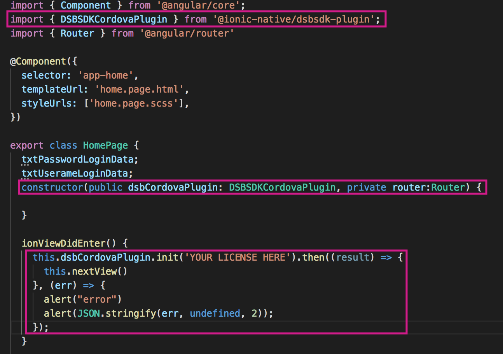

# DSB Mobile: Code Examples for Ionic

[Description](#desc)

[Technical Information](#tech-desc)

[Demo](#demo)

[Previous Configurations](#considerations)

[License](#license)
<a name="desc"></a>


# Description

This code repository helps you to understand the correct implementation of the native libraries of DSB Mobile using Ionic. The demo of this repository has the most important functionalities of DSB Mobile integrated. You can implement those functionalities to match your company's business logic.

>For more information of the DSB Mobile implementation, refer to the *Developer Guide*.

<a name="tech-desc"></a>
# Technical Information

This repository uses DSB Mobile 5.0. If you are using a previous version of the SDK, it is recommended to check the *Upgrade Guide* to get up to date with the benefits of the latest version of DSB Mobile.

### iOS

- Base SDK compiled: iOS 12.2.
- OS versions compatibility: From 8 to 12.
- Programing Language: Objective - C.

### Android

- API level SDK compiled: 28.
- API level version compatibility: From 16 to 28.
- Programing Language: Java.
- Dependency: Gson Library.

<a name="demo"></a>
# Demo
The project included in this repository runs a demo app that has two activities:

### Login activity
In this activity DSB Mobile is initialized. Once initialized, it validates the status of the device and the legitimacy of the connection to your company's servers. If both validations are completed successfully and no risks are found, DSB Mobile allows the login and sends the login data captured.

### Main activity
Once the login is completed, you are free to use the most important methods offered by DSB Mobile.

>This repository does not include the DSB Mobile library. To successfully execute the demo, it must have the DSB Mobile library integrated. Contact [Cyxtera][cyxtera] to get the libraries for Android and iOS.

<a name="considerations"></a>

# Previous Configurations

To  integrate DSB Mobile using Ionic, it is necessary to complete the following configurations:

>This section is meant to help you understand how to integrate the DSB Mobile library in your project. The repository's project already has this configurations.

## Creating the Ionic Native wrapper

>This wrapper was created using the DSB SDK Cordova plugin and the following instructions are for apps built with Ionic Framework 4.0.0.

### Adding the Cordova Plugin

Add the *DSB SDK Cordova Plugin* to the project:

1. Go to the folder where the **config.xml** file of your project is located.
2. Run the *Terminal* from that folder and execute the following command:

```
ionic cordova plugin add [path DSB SDK Cordova Plugin]
```

### Download Ionic Native

1. Download the Ionic-Native repository  from this link [Ionic Native][ionic_native_repo].

2. Go to the recently downloaded **ionic-native-master** folder.

3. Open the *Terminal* from that folder.

4. Execute the following command:

```
npm install @ionic-native/core --save
```

### Creating the wrapper

Once Ionic Native is downloaded, you can create the wrapper:

1. Create the folders **plugins/dsbsdk-plugin** in the following path: **ionic-native-master/src/@ionic-native**

2. In the folder **dsbsdk-plugin** create a .ts file to write the wrapper. This is the example for DSB Mobile:

```
import { Injectable } from '@angular/core';

import { Plugin, Cordova, CordovaProperty, CordovaInstance, InstanceProperty, IonicNativePlugin } from '@ionic-native/core';

@Plugin({

pluginName: 'DSBSDKCordovaPlugin',

plugin: 'net.easysol.dsb.DSBSDKCordovaPlugin',

pluginRef: 'window.DSBSDKCordovaPlugin',

platforms: ['Android', 'iOS']

})

@Injectable({

providedIn: 'root'

})

export class DSBSDKCordovaPlugin extends IonicNativePlugin {

@Cordova({

callbackOrder: 'reverse'

})

init(licenseKey: string, domain?: string): Promise<any> {

return;

}

@Cordova({

callbackOrder: 'reverse'

})

sendLoginData(args: {}): Promise<any> {

return;

}

@Cordova({

callbackOrder: 'reverse'

})

getDeviceID(): Promise<any> {

return;

}

@Cordova({

callbackOrder: 'reverse'

})

isDeviceRooted(): Promise<any> {

return;

}

.
.
.
}
```

> To review all the methods of DSB Mobile, consult the *Developer Guide*

3. Open the Terminal and go to the **ionic-native-master** folder to execute the following command:

```sh
npm run build
```

When you execute the previous line, the wrapper is included in the following path: **ionic-native-master/dist/@ionic-native/plugins/dsbsdk-plugin**

## Adding the wrapper to the project

Move the **dsbsdk-plugin** folder from **ionic-native-master/dist/@ionic-native/plugins** to the modules of the Ionic project **node_modules/@ionic-native**.

You can use DSB Mobile as shown below:



- Import the module in the class.
- Inject the library in the constructor.
- Use the SDK (Ex: Init method).

> For more information of the use of Ionic Native, go to:
> [Ionic Native Developer Guide][ionic_native_dev]

<a name="license"></a>

## License

----

[//]: #

[cyxtera]: <https://www.cyxtera.com>

[ionic_native_repo]: <https://github.com/ionic-team/ionic-native>

[ionic_native_dev]: <https://github.com/ionic-team/ionic-native/blob/master/DEVELOPER.md>
